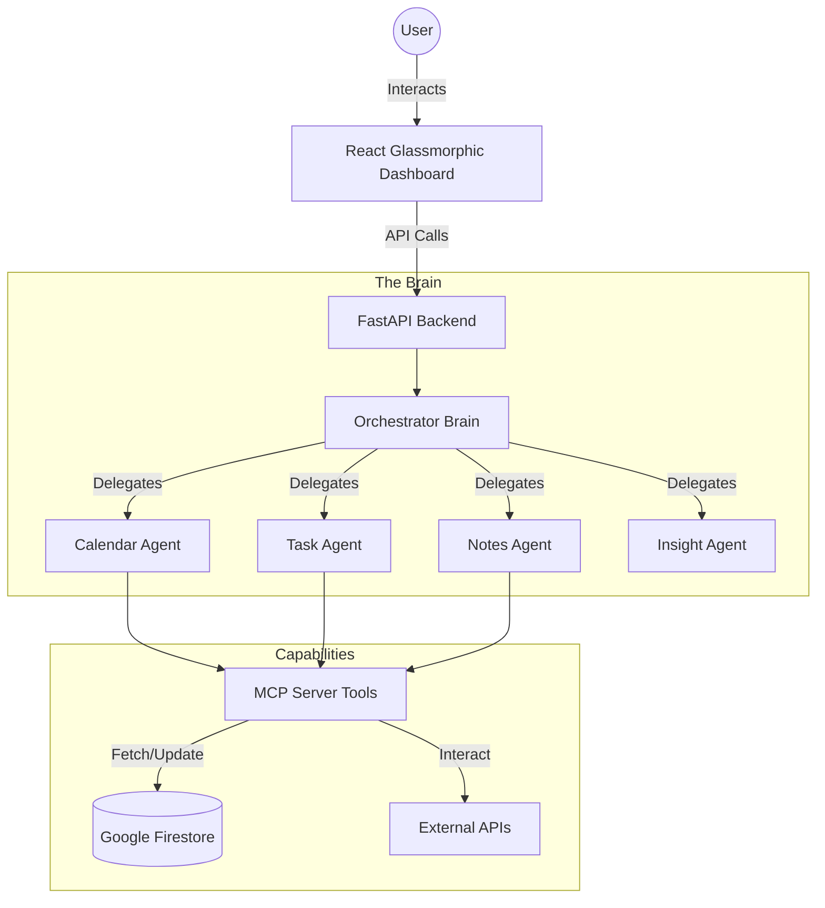

# 🤖 AutoRoutine AI: The Multi-Agent Productivity OS

[](https://fastapi.tiangolo.com/)
[](https://reactjs.org/)
[](https://cloud.google.com/)
[](https://modelcontextprotocol.io/)
[](https://www.docker.com/)

**AutoRoutine AI** is a next-generation productivity operating system designed to eliminate cognitive load. It doesn't just manage your tasks—it orchestrates your life through a specialized ecosystem of autonomous AI agents.

---

## 🌌 The Vision
Modern productivity is broken. We switch between calendars, task lists, and note-taking apps, acting as the manual "connector" between these silos. **AutoRoutine AI** acts as your digital co-pilot, proactively resolving conflicts, summarizing insights, and anticipating your needs before you even open your dashboard.

---

## 🏗️ System Architecture



---

## 🌟 Advanced Features

### 🧠 Autonomous Multi-Agent Orchestration
Powered by **Google Gemini 1.5 Pro/Flash** and the **Google ADK**, our orchestrator handles complex intent extraction:
*   **📅 CalendarAgent**: Beyond just scheduling, it identifies "context-heavy" blocks and protects your deep-work time.
*   **✅ TaskAgent**: Uses an Eisenhower Matrix approach to auto-prioritize based on upcoming deadlines and meeting density.
*   **📝 NotesAgent**: Extracts action items from unstructured meeting notes and syncs them directly to the TaskAgent.
*   **💡 InsightAgent**: Generates post-day summaries and suggests efficiency improvements.

### 🔌 Model Context Protocol (MCP) Power
We've implemented a custom **MCP Server** that exposes 16+ granular tools. This allows LLMs to interact with your data with surgical precision, reducing hallucinations and ensuring data integrity.

### ⚡ Proactive "Morning Briefing"
Every morning, the system cross-references your day. If you have 6 hours of meetings and 4 hours of high-priority tasks, it flags an **"Impossible Day"** and suggests which tasks to delegate or postpone.

---

## 🛠️ Tech Stack

| Layer | Technologies |
| :--- | :--- |
| **Frontend** | React 19, Vite, Lucide Icons, Vanilla CSS (Premium Glassmorphism) |
| **Backend** | Python 3.11+, FastAPI, Pydantic v2, Google ADK |
| **Artificial Intelligence** | Gemini 1.5 Pro, Vertex AI, Google Generative AI |
| **Data Persistence** | Google Cloud Firestore (Real-time NoSQL) |
| **Infrastructure** | Docker, Google Cloud Run, GitHub Actions |

---

## 🚀 Deployment & Setup

### 1️⃣ Local Development
```bash
# Clone the repository
git clone https://github.com/your-repo/AutoRoutine-AI.git
cd AutoRoutine-AI

# Setup Backend
cd backend
python -pv venv venv
source venv/bin/activate # Windows: venv\Scripts\activate
pip install -r requirements.txt

# Setup Frontend
cd ../frontend
npm install
npm run dev
```

### 2️⃣ Docker (Production Grade)
```bash
docker-compose up --build
```

### 3️⃣ Enterprise Cloud Deployment (GCP)
This project is configured for **Google Cloud Run** via **Cloud Build**.
```bash
gcloud builds submit --config cloudbuild.yaml --substitutions=_VITE_API_URL="your-api-url"
```

---

## 📂 Project Structure

```text
AutoRoutine-AI/
├── backend/
│   ├── agents/          # Core LLM Agent Logic
│   ├── api/             # RESTful Endpoints
│   ├── autoroutine_mcp/ # Custom MCP Implementation
│   ├── db/              # Firestore Connectivity
│   └── scripts/         # Verification & Seeding
├── frontend/
│   ├── src/             # Dashboard & UI Components
│   └── public/          # Assets
├── cloudbuild.yaml      # CI/CD Pipeline Configuration
└── docker-compose.yml   # Multi-container Orchestration
```

---

## 🔒 Security First
*   **Encapsulated Logic**: All API keys are loaded via secure environment variables.
*   **Service Account Integration**: Designed to use GCP IAM for secure resource access without hardcoded credentials.
*   **Stateless Scaling**: Backend is built to scale horizontally on Cloud Run.

---

## 🤝 Contributing
Join us in building the future of productivity!
1. Fork the repo.
2. Create your feature branch (`git checkout -b feature/AmazingFeature`).
3. Commit your changes (`git commit -m 'Add AmazingFeature'`).
4. Push to the branch (`git push origin feature/AmazingFeature`).
5. Open a Pull Request.

---

*Built with ❤️ for the AI Generation.* 🚀
